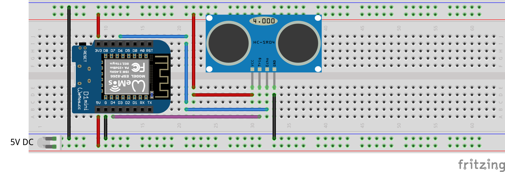

# Mongoose OS demo firmware for using HC-SR04 sensor
## Overview
This is a [Mongoose-OS](https://mongoose-os.com/) demo firmware for using HC-SR04, a popular ultrasonic distance sensor. This firmware uses the native [hcsr04 library](https://github.com/zendiy-mgos/hcsr04).
## GET STARTED
Build up your device in few minutes just downloading, compiling and flashing this demo.

Clone the repo:
```bash
$ git clone https://github.com/zendiy-mgos/hcsr04-demo.git my-hcsr04-demo
$ cd my-hcsr04-demo
```
Enable JavaScript demo (skip to continue with C/C++ demo) :
```yaml
sources:
# - src
  - src_js
libs:
  - origin: https://github.com/mongoose-os-libs/mjs
  - ...
```
Build the binary:
```bash
$ mos build --platform <device_platform>
```
Flash the firmware:
```bash
$ mos flash --port <port_name>
```
## Hardware
### Compatible sensors
You can use one of the following sensors and follow the wiring schema below.
|Model||Notes|
|--|--|--|
||HC-SR04|Mind to use a 3.3V compatible verison of the sensor.|
||RCW-0001|This sensor natively supports both 3.3V and 5V VCC.|
### Wiring schema
You can use a Wemos D1 mini follow the wiring schema below.

