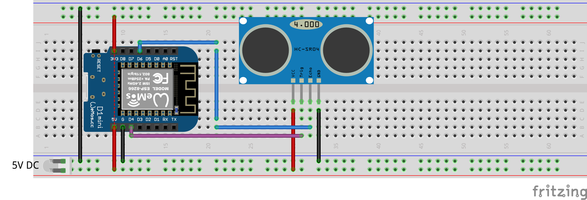

# Mongoose OS demo firmware for using HC-SR04 sensor
## Overview
This is a [Mongoose-OS](https://mongoose-os.com/) demo firmware for using HC-SR04, a popular ultrasonic distance sensor. This firmware uses the native [hcsr04 library](https://github.com/zendiy-mgos/hcsr04).
## GET STARTED
Build up your device in few minutes just downloading, compiling and flashing this demo.

Clone the repo:
```bash
$ git clone https://github.com/zendiy-mgos/hcsr04-demo.git my-hcsr04-demo
$ cd my-hcsr04-demo
```
Enable JavaScript demo (skip to continue with C/C++ demo) :
```yaml
sources:
# - src
  - src_js
libs:
  - origin: https://github.com/mongoose-os-libs/mjs
  - ...
```
Build the binary:
```bash
$ mos build --platform <device_platform>
```
Flash the firmware:
```bash
$ mos flash --port <port_name>
```
## Hardware
### Compatible sensors
You can use one of the [hcsr04 library compatible sensors](https://github.com/zendiy-mgos/hcsr04/blob/master/README.md#compatible-sensors).
### Wiring schemas
**EXAMPLE 1**: this example shows how to wire a sensor that runs from 3.3V.

Used components:
 - Wemos D1 mini board
 - RCW-0001 sensor
 - 5V DC power supply (via min-USB cable or via external power supply)


**EXAMPLE 2**: this example shows how to wire a standard sensor that runs from 5V.

DISCLAIMER: there has been some [debate on whether the ESP8266 is actually 5V tolerant on GPIO inputs](https://www.ba0sh1.com/blog/2016/08/03/is-esp8266-io-really-5v-tolerant/). I personally used this configuration without having any issue, but the decision to take the risk of burning the input pin is in your hands.

Used components:
 - Wemos D1 mini board
 - HC-SR04 sensor
 - 5V DC power supply (via min-USB cable or via external power supply)

